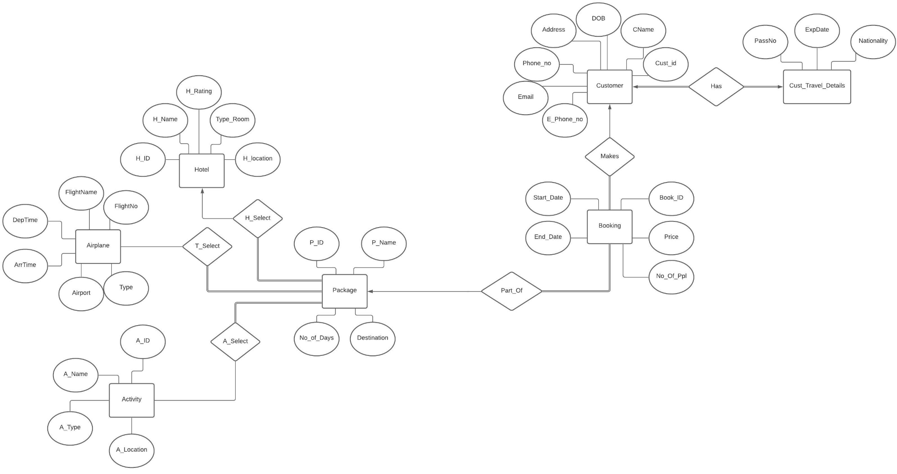
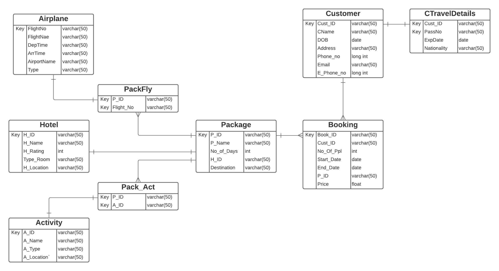
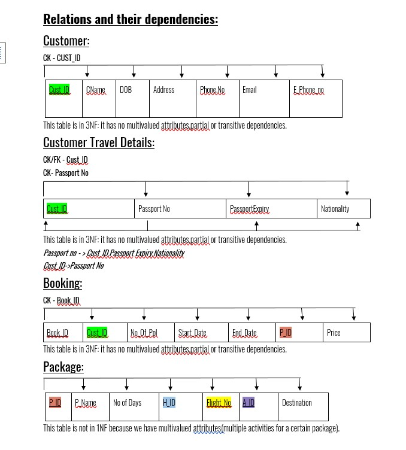
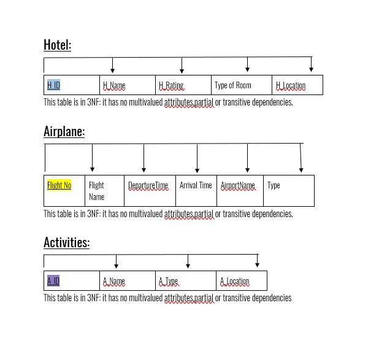
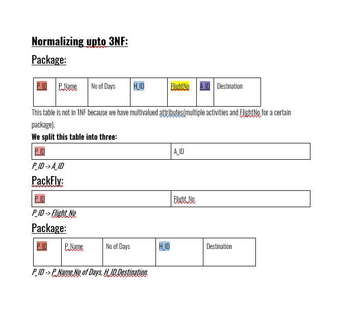
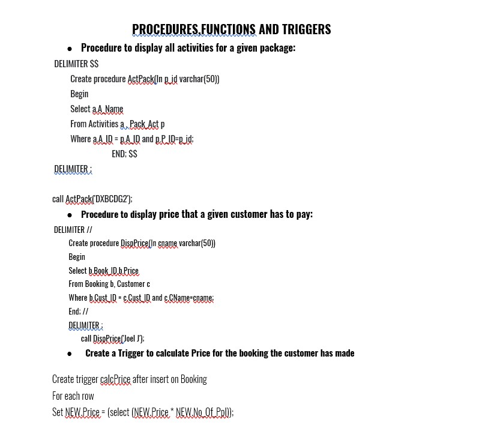

# Travel_Agency_Database_Project# Database Project
 
This is a mini database project here the topic used is a travel agency. This repo consists of all the required code to create this database I have also included the ER diagram for better visualization.        
 
 

## REQUIREMENTS SPECIFICATION:
 
We have created a Database System for a Travel Agency called ‘Travel Agency’ located in the United Arab Emirates.

We require a Customer’s Personal Details as well as their Travel Details to be entered into our system. When a Customer decides on which Package they want to avail, a Booking is made for them.

Our Database provides Packages to a Customer based on the location they wish to travel to. 
Packages come with multiple hotels for a destination. We also provide an option of Activities that a Customer can choose ranging from sightseeing to entertainment! 

The Entity Sets we have started off with is 
Customer - contains personal and contact details of a customer
Customer Travel Details -  contains a customer’s passport details
Booking- contains booking id, start and end date of the booking and the price
Package- contains details of the hotel, transport and activities of a package
Airplane- contains information about flight details, such as FlightNo and departure time etc.
Hotel- contains information about the hotel where the customer will be staying
Activity- contains information about the activities provided in the package 

 

## Conceptual Design -EER Diagram

## RELATIONAL MODEL:

### Document create_insert.txt consist of all the create and sample input code for every table

